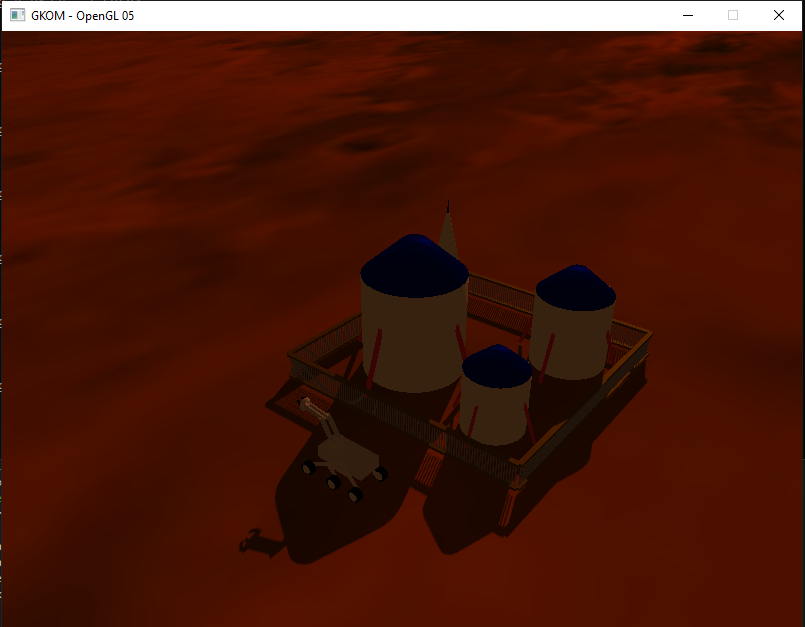

# [GKOM] Projekt OpenGL
## 201. Łazik marsjański 
### Skład zespołu
1. Adam Szałowski, 300275
2. Maciej Dmowski, 300202
3. Michał Stopyra, 292794
4. Jacek Tomaszek, 283779
### Podział zadań
1. Adam Szałowski - oświetlenie, cienie, regulacja intensywności
2. Maciej Dmowski - model łazika, teksturowanie
3. Michał Stopyra - elementy ruchome, scenografia
4. Jacek Tomaszek - obsługa kamery i sterowania ruchem łazika
### Zdjęcie obiektu do zamodelowania

### Milestones
- [x] Przygotować listę zadań
- [x] Stworzenie wstępnego projektu OpenGL
- [x] Stworzenie podłoża
- [x] Stworzenie modelu łazika
- [x] Obsługa ruchu kamery
- [x] Poruszanie się łazika po podłożu
- [x] Obsługa elementów ruchomych
- [x] Interaktywne oświetlenie
- [x] Cieniowanie
- [ ] Prezentacja gotowego projektu na spotkaniu nr 7
### Literatura
- https://www.tomdalling.com/blog/modern-opengl/
- https://learnopengl.com/
- https://www.youtube.com/channel/UC1Gx4dn-QcSpJtZNdiqxy0A
- https://www.youtube.com/user/briantwill
- https://www.youtube.com/watch?v=W3gAzLwfIP0&list=PLlrATfBNZ98foTJPJ_Ev03o2oq3-GGOS2&ab_channel=TheCherno
- https://www.youtube.com/watch?v=YDy8ZACpKco&t=200s&ab_channel=ThePentamollisProject
### Zrzut ekranu z końcowej wersji projektu

