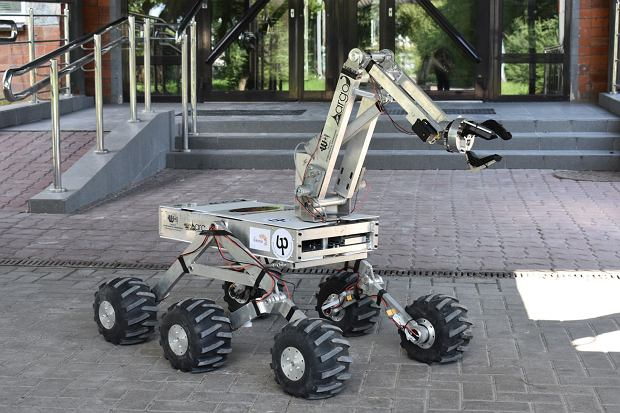
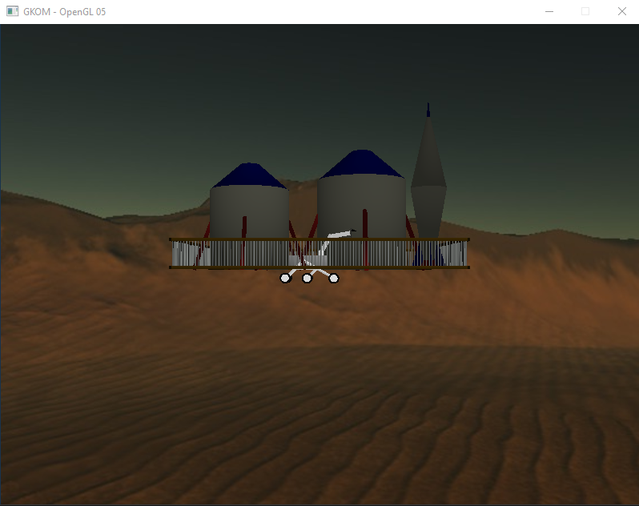

# [GKOM] Projekt OpenGL
## 201. Łazik marsjański 
### Skład zespołu
1. Adam Szałowski, 300275
2. Maciej Dmowski, 300202
3. Michał Stopyra, 292794
4. Jacek Tomaszek, 283779
### Podział zadań
1. Adam Szałowski - oświetlenie, cienie, regulacja intensywności
2. Maciej Dmowski - model łazika, teksturowanie
3. Michał Stopyra - elementy ruchome, scenografia
4. Jacek Tomaszek - obsługa kamery i sterowania ruchem łazika
### Zdjęcie obiektu do zamodelowania

### Milestones
- [x] Przygotować listę zadań
- [x] Stworzenie wstępnego projektu OpenGL
- [ ] Stworzenie podłoża
- [ ] Stworzenie modelu łazika
- [ ] Obsługa ruchu kamery
- [ ] Poruszanie się łazika po podłożu
- [ ] Obsługa elementów ruchomych
- [ ] Interaktywne oświetlenie
- [ ] Cieniowanie
- [ ] Prezentacja gotowego projektu na spotkaniu nr 7
### Literatura
TODO
### Zrzut ekranu z wersji 0 projektu

